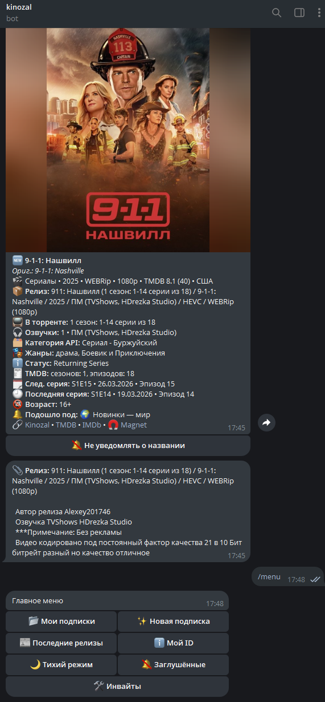

# Kinozal Bot

[](https://github.com/cardi101/kinozal_bot/actions/workflows/ci.yml)
[](./LICENSE)


Telegram-бот для мониторинга новых релизов на [Kinozal.tv](https://kinozal.tv). Отправляет уведомления по подпискам с обогащением через TMDB — постеры, рейтинги, жанры, статус сериала.

Текущий релиз: `1.1.0`. Краткая история изменений — в [CHANGELOG.md](./CHANGELOG.md).

<p align="center">
  
</p>

---

## Возможности

- **Гибкие подписки** — фильтры по типу медиа, году, рейтингу TMDB, жанрам, странам, форматам, ключевым словам
- **Пресеты и мастер** — готовые конфигурации (новинки кино, аниме, сериалы и др.) + пошаговое создание
- **TMDB-обогащение** — постер, рейтинг, обзор, статус сериала, дата следующей серии
- **Отслеживание изменений** — при изменении описания раздачи приходит обновление с выделенными строками (➕/➖)
- **Группировка** — несколько версий одного тайтла (разные озвучки, качество) объединяются в одно сообщение
- **Тихий режим** — настраиваемое окно тишины по локальной timezone пользователя; если timezone не задана, используется безопасный fallback `UTC`
- **Mute по названию** — кнопка 🔕 на каждом уведомлении, управление списком через меню
- **История доставок** — последние уведомления с датами и ссылками (`/history`)
- **Тест подписки** — предпросмотр совпадений на реальных данных без ожидания поллинга
- **Магнет-ссылки** — прямые ссылки через встроенный редирект-сервер
- **Инвайт-система** — доступ по приглашениям с ограничением числа использований и сроком
- **Админ-панель** — управление пользователями, доступами, диагностика совпадений TMDB

---

## Быстрый старт

### Требования

- Docker и Docker Compose
- Аккаунт на [Kinozal.tv](https://kinozal.tv)
- [Telegram Bot Token](https://t.me/BotFather)
- [TMDB API Read Token](https://www.themoviedb.org/settings/api)
- Redis из `docker-compose.yml`; по умолчанию бот использует `redis://redis:6379/0`

### Установка

```bash
git clone https://github.com/cardi101/kinozal_bot.git
cd kinozal_bot

cp .env.example .env
nano .env

docker compose up -d --build
docker compose logs -f app
```

### Обновление

```bash
git pull
docker compose up -d --build
```

Миграции БД применяются автоматически при старте.
Для рабочего инстанса не используй `docker compose down -v`: этот флаг удаляет volume'ы, включая Postgres data.

### Локальная разработка

Для локальной проверки без Docker:

```bash
make install
make lint
make typecheck
make test
make check
make smoke
make monitoring-up
```

`make install` создаёт локальный `.venv` и ставит runtime-зависимости проекта вместе с `pytest`, `pytest-cov`, `ruff` и `mypy`.
`make smoke` поднимает `postgres + redis + api`, проверяет `/health`, `schema_migrations`, bootstrap-пути `app`/`api`, repository CRUD smoke и worker end-to-end smoke внутри контейнера.
`make monitoring-up` поднимает optional `Prometheus` и `Grafana`.

---

## Конфигурация

Все настройки задаются через `.env`. Шаблон — `.env.example`.

| Переменная | Описание | Обязательно |
|---|---|---|
| `BOT_TOKEN` | Токен Telegram-бота | ✅ |
| `ADMIN_IDS` | Telegram user_id администраторов (через запятую) | ✅ |
| `KINOZAL_USERNAME` | Логин на Kinozal.tv | ✅ |
| `KINOZAL_PASSWORD` | Пароль на Kinozal.tv | ✅ |
| `TMDB_TOKEN` | TMDB API Read Access Token | ✅ |
| `POSTGRES_VOLUME_NAME` | Явное имя Docker volume для Postgres data, чтобы не получить новый пустой volume при смене compose project name | — |
| `DATABASE_URL` | PostgreSQL DSN | ✅ |
| `REDIS_URL` | Redis URL | ✅ |
| `ALLOW_MODE` | `open` — открытый доступ, `invite` — только по инвайтам, `manual` — ручная выдача доступа | — |
| `POLL_SECONDS` | Интервал опроса Kinozal (по умолчанию `120`) | — |
| `BOOTSTRAP_AS_READ` | При первом запуске пометить текущие релизы как доставленные (`1`/`0`) | — |
| `TMDB_LANGUAGE` | Язык TMDB (по умолчанию `ru-RU`) | — |
| `DEEP_LINK_BOT_USERNAME` | Username бота для магнет-ссылок | — |
| `MAGNET_BASE_URL` | Публичный URL магнет-сервера, например `https://magnet.example.com` | — |
| `API_HOST` | Host для optional HTTP API (по умолчанию `0.0.0.0`) | — |
| `API_PORT` | Порт для optional HTTP API (по умолчанию `8000`) | — |
| `ADMIN_HTTP_TOKEN` | Токен для `/admin/*` HTTP endpoints; если пустой, admin HTTP выключен | — |
| `SENTRY_DSN` | DSN для отправки runtime-ошибок в Sentry; если пустой, Sentry выключен | — |
| `SENTRY_ENVIRONMENT` | Environment tag для Sentry (например `production`, `staging`) | — |
| `SENTRY_TRACES_SAMPLE_RATE` | Trace sampling rate для Sentry, по умолчанию `0.0` | — |
| `SENTRY_RELEASE` | Release tag для Sentry, если хочешь привязку ошибок к commit/release | — |
| `PROMETHEUS_PORT` | Порт optional Prometheus (по умолчанию `9090`) | — |
| `ALERTMANAGER_PORT` | Порт optional Alertmanager (по умолчанию `9093`) | — |
| `GRAFANA_PORT` | Порт optional Grafana (по умолчанию `3000`) | — |
| `GRAFANA_ADMIN_USER` | Admin user для Grafana | — |
| `GRAFANA_ADMIN_PASSWORD` | Admin password для Grafana | — |

> **Магнет-ссылки** требуют публичного домена с HTTPS — Telegram не открывает `http://` ссылки в клиенте.
> Нужно: купить домен, направить его A-запись на сервер, прописать в `Caddyfile` и задать `MAGNET_BASE_URL`.
> Если магнет-ссылки не нужны — просто не задавай эти переменные, бот работает без них.

---

## Команды

| Команда | Описание |
|---|---|
| `/menu` | Главное меню |
| `/subs` | Список подписок |
| `/history` | Последние 15 доставленных релизов |
| `/muted` | Заглушённые названия |
| `/quiet [ЧЧ ЧЧ\|off]` | Тихий режим: установить окно или отключить |
| `/start` | Начало работы, активация инвайта |

### Управление доступом

При `ALLOW_MODE=invite` пользователи активируют бота через инвайт-код. Создать инвайт можно из админ-панели:

```
/create_invite <uses> <days> <note>
```

Пример: `/create_invite 1 30 друг` — одноразовый инвайт на 30 дней.
Пользователь вводит код через `/start КОД` или просто отправляет код боту.

---

## Архитектура

```
app.py                  — точка входа, регистрация роутеров
app_bootstrap.py        — composition root, сборка зависимостей и router wiring
runtime_poller.py       — тонкий worker entrypoint, сборка зависимостей
runtime_app.py          — запуск бота и планировщика
api.py                  — ASGI entrypoint для optional HTTP API
api_app.py              — FastAPI routes и auth dependency
api_bootstrap.py        — composition root для HTTP API

services/worker_service.py      — orchestration цикла поллинга и доставки
services/kinozal_service.py     — фасад над Kinozal source/details
services/tmdb_service.py        — фасад над TMDB client
services/subscription_service.py — матчинг и работа с подписками
services/delivery_service.py    — доставка и группировка уведомлений
services/admin_api_service.py   — health/metrics/admin debug/reparse facade

domain/models.py        — внутренние модели item/subscription/delivery для worker pipeline

repositories/worker_repository.py — repository adapter для worker-цикла
repositories/users_repository.py  — пользователи, инвайты, quiet-hours
repositories/subscriptions_repository.py — подписки, жанры, страны
repositories/items_repository.py  — items, timelines, cleanup, rematch
repositories/delivery_repository.py — deliveries, debounce, muted, history
repositories/meta_repository.py   — meta и TMDB genres
db_migrations.py        — migration runner и schema_migrations bookkeeping
migrations/0001_initial_schema.sql — baseline schema migration
db.py                   — тонкий PostgreSQL facade и запуск migrations
redis_cache.py          — кеш TMDB-запросов

subscription_matching.py   — матчинг элемента под подписку
delivery_formatting.py     — форматирование сообщений
delivery_sender.py         — отправка в Telegram

*_handlers.py           — обработчики команд и кнопок
keyboards.py            — inline-клавиатуры
```

**Цикл доставки (3 фазы):**

1. **Сбор** — новые элементы обогащаются через TMDB, проверяются изменения текста релиза
2. **Flush** — доставка накопленных уведомлений после окончания тихого режима
3. **Доставка** — матчинг по подпискам, группировка по TMDB ID, учёт тихого режима

---

## HTTP API

`FastAPI` здесь опционален и не заменяет worker. Основной engine остаётся в poller-процессе, а HTTP-слой нужен для health, diagnostics и admin actions.

Доступные endpoints:

- `GET /health`
- `GET /metrics`
- `GET /admin/subscriptions/{user_id}`
- `GET /admin/match-debug?kinozal_id=...&live=true`
- `POST /admin/reparse/{kinozal_id}`
- `GET /admin/release-timeline?kinozal_id=...`
- `GET /admin/explain-delivery?kinozal_id=...&tg_user_id=...`
- `POST /admin/replay-delivery?kinozal_id=...&tg_user_id=...&force=false`

`/metrics` отдаёт Prometheus text exposition format и включает health/db метрики, а также worker counters вроде `items_fetched`, `deliveries_sent`, `debounce_queued` и длительности последнего цикла.

`/admin/*` endpoints защищены заголовком `X-Admin-Token`. Если `ADMIN_HTTP_TOKEN` не задан, admin HTTP endpoints отключены и возвращают `503`.
`SENTRY_DSN` опционален: если он задан, и worker, и `api` будут отправлять unhandled exceptions и `ERROR`-логи в Sentry.

Полезные admin-команды в Telegram:

- `/explainmatch <kinozal_id>`: показать, как сработал TMDB/match routing
- `/deliveryaudit <kinozal_id> [tg_user_id]`: показать, почему релиз реально ушёл в подписки
- `/route anime|dorama|turkey|world`: вручную перекинуть релиз, ответив на сообщение бота

Примеры:

```bash
curl http://localhost:8000/health
curl http://localhost:8000/metrics
curl -H "X-Admin-Token: $ADMIN_HTTP_TOKEN" http://localhost:8000/admin/subscriptions/123456789
curl -H "X-Admin-Token: $ADMIN_HTTP_TOKEN" "http://localhost:8000/admin/match-debug?kinozal_id=12345&live=true"
curl -X POST -H "X-Admin-Token: $ADMIN_HTTP_TOKEN" http://localhost:8000/admin/reparse/12345
curl -H "X-Admin-Token: $ADMIN_HTTP_TOKEN" "http://localhost:8000/admin/release-timeline?kinozal_id=12345"
curl -H "X-Admin-Token: $ADMIN_HTTP_TOKEN" "http://localhost:8000/admin/explain-delivery?kinozal_id=12345&tg_user_id=443539115"
curl -X POST -H "X-Admin-Token: $ADMIN_HTTP_TOKEN" "http://localhost:8000/admin/replay-delivery?kinozal_id=12345&tg_user_id=443539115&force=false"
```

### Repair / Backfill

Для поиска исторически пропущенных progress-апдейтов есть отдельные dry-run/apply скрипты:

```bash
docker compose exec -T app python scripts/audit_missing_progress_versions.py --with-users-only --limit 20
docker compose exec -T app python scripts/repair_missing_progress_deliveries.py --limit 20
docker compose exec -T app python scripts/repair_missing_progress_deliveries.py --apply --limit 20
docker compose exec -T app python scripts/backfill_audio_and_version_fields.py --limit 50
docker compose exec -T app python scripts/backfill_audio_and_version_fields.py --apply --limit 50
```

`repair_missing_progress_deliveries.py` по умолчанию работает безопасно:

- берёт только `latest_gap` кандидатов
- смотрит только пользователей, у которых релиз реально доставлялся раньше
- перед replay повторно прогоняет `explain_delivery`, поэтому без `ready`-статуса ничего не досылает

Для structured release parsing есть отдельный idempotent backfill:

```bash
docker compose exec -T app python scripts/backfill_parsed_release_fields.py --limit 50
docker compose exec -T app python scripts/backfill_parsed_release_fields.py --apply --limit 50
```

Он пересчитывает `parsed_release_json` и derived release fields (`source_year`, `source_format`, `source_episode_progress`, `source_audio_tracks`, `version_signature`) in place, не создаёт новых delivery claims и не делает replay старых уведомлений.

### Debug / Explain

- `explain_delivery` теперь показывает structured subscription explain, compiled subscription snapshot, quiet-hours status, debounce/pending state и blockers.
- `match-debug` теперь сохраняет TMDB search plan, candidate ranking, features per candidate, validator reject reason и accepted path в `tmdb_match_debug`.
- `delivery_audit` хранит semantic `event_type` / `event_key`, поэтому можно отличить обычную доставку релиза от `release_text`-апдейта.

`backfill_audio_and_version_fields.py` пересчитывает только derived audio/version поля in place и по умолчанию работает в dry-run.

---

## Monitoring

Monitoring stack опционален и поднимается отдельным compose profile:

```bash
make monitoring-up
```

После старта доступны:

- `Prometheus` — `http://localhost:${PROMETHEUS_PORT:-9090}`
- `Alertmanager` — `http://localhost:${ALERTMANAGER_PORT:-9093}`
- `Grafana` — `http://localhost:${GRAFANA_PORT:-3000}`

В `Grafana` datasource и dashboard провиженятся автоматически:

- datasource: `Prometheus`
- dashboard: `Kinozal Bot Overview`

В `Prometheus` уже загружаются alert rules:

- `KinozalApiDown`
- `KinozalDatabaseDown`
- `KinozalSourceDown`
- `KinozalWorkerCycleStalled`
- `KinozalWorkerCycleFailures`

`Alertmanager` тоже поднимается этим profile и отправляет firing/resolved alerts администраторам в Telegram через внутренний сервис `alert-webhook`. Этот webhook не публикуется наружу и доступен только внутри compose-сети.

---

## Инфраструктура

| Сервис | Образ | Назначение |
|---|---|---|
| `app` | python:3.12-slim | Telegram-бот |
| `api` | python:3.12-slim | Optional FastAPI facade для health/admin/debug |
| `postgres` | postgres:16 | Основная БД |
| `redis` | redis:7-alpine | Кеш TMDB |
| `magnet-web` | python:3.12-slim | HTTP-редирект для магнет-ссылок |
| `caddy` | caddy:2 | Обратный прокси с TLS |
| `prometheus` | prom/prometheus:v2.54.1 | Optional metrics scraping и alert rules |
| `alertmanager` | prom/alertmanager:v0.27.0 | Optional alert routing |
| `alert-webhook` | python:3.12-slim | Internal Telegram forwarder для Alertmanager alerts |
| `grafana` | grafana/grafana:11.1.0 | Optional dashboards |

### Диагностика

```bash
# Логи
docker compose logs -f app
docker compose logs -f api

# Состояние сервисов
docker compose ps

# Консоль БД
docker compose exec postgres psql -U postgres -d kinozal_news

# Бэкап
docker compose exec -T postgres pg_dumpall -U postgres > backup.sql

# Активный volume с данными Postgres
docker volume inspect "$POSTGRES_VOLUME_NAME"
```

Postgres data привязан к явному имени volume из `POSTGRES_VOLUME_NAME`. Это снижает риск потерять БД из-за смены compose project name или другого окружения с тем же репозиторием.

---

## Contributing

1. Fork the repository
2. Create a feature branch (`git checkout -b feature/my-feature`)
3. Make your changes and ensure `make check` passes
4. Commit (`git commit -m 'Add my feature'`)
5. Push and open a Pull Request

---

## Фильтрация русского контента

По умолчанию бот **пропускает раздачи с русским контентом** — категории «Русский», «Русская», «Русское», «Наше Кино» и тайтлы с меткой `/ РУ /`.

Чтобы отключить этот фильтр, удалите в `services/worker_service.py` блок:

```python
if any(kw in category for kw in ("Русский", "Русская", "Русское", "Наше Кино")) or "/ РУ /" in title:
    log.info("Skip Russian item: %s [%s]", title, category)
    continue
```

После этого пересоберите контейнер: `docker compose up -d --build`.

---

## Лицензия

[MIT](./LICENSE)
